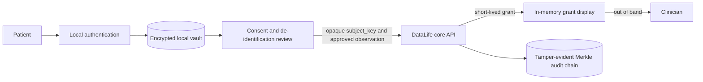

# DataLife Mobile App

> A patient-sovereign mobile vault and consent companion for DataLife e-Health.

[](LICENSE)
[](#project-status)
[](CONTRIBUTING.md)

`datalife-mobile-app` is the planned patient-controlled trust anchor for the
[DataLife e-Health](https://github.com/datalife-ehealth) ecosystem. It will keep
direct identity data on the patient's device, request narrowly scoped access grants,
and prepare de-identified observations for the core service.

> [!IMPORTANT]
> This repository currently contains the architecture and community scaffold; it
> does **not** yet contain a runnable mobile application. It is research software,
> not a certified EHR or medical device, and must not be used for clinical care,
> identity custody, or emergency response.

## Project status

**Scaffold / implementation lead wanted.** Framework selection, vault design, and
the first consent workflow are open for RFC review. Product code should begin only
after the threat model and platform tradeoffs are explicit.

## Zero Cloud PII Invariant

Names, CPF or other government identifiers, phone numbers, email addresses,
emergency contacts, and the mapping from identity to `subject_key` remain inside the
patient-controlled trust boundary. They must never be uploaded to the DataLife core,
remote logging, analytics, crash reporting, notification payloads, or cloud backup.

An opaque `subject_key` is a pseudonymous correlation identifier, not anonymous or
public data. It must be protected and rotated or recovered only through a future,
explicitly reviewed protocol.

## Scope

### This repository is intended to own

- an encrypted, on-device identity vault and its lifecycle UX;
- local creation and custody of opaque subject identifiers;
- consent UX for requesting and displaying short-lived clinician access grants;
- de-identification and review before observation submission;
- privacy-preserving local timelines derived from patient-approved data; and
- platform protections for screenshots, clipboard use, background previews,
  notifications, backups, and device compromise where supported.

### This repository does not own

- central storage of PII or identity-to-subject mappings;
- server authorization, physician verification, grant signing, or TTL enforcement;
- clinical payload persistence or Merkle audit implementation;
- diagnosis, triage, prescribing, treatment, billing, or emergency response; or
- a promise that device encryption alone protects a rooted, jailbroken, or otherwise
  compromised device.

Server-side responsibilities remain in
[`datalife-datalake-core`](https://github.com/datalife-ehealth/datalife-datalake-core).

## Intended architecture



Encryption keys should use hardware-backed Keychain or Keystore facilities when
available. Bulk vault content requires an encrypted application store; a generic
key-value secure store is not automatically suitable. Recovery, migration, backup,
and device-loss behavior are security protocols, not convenience features.

## Current core API dependency

The current core reference implementation exposes:

| Workflow | Method and path | Mobile responsibility |
|---|---|---|
| Submit an approved observation | `POST /api/v1/ingest` | Send only `subject_key`, `kind`, `media_type`, and reviewed body content. |
| Request an access grant | `POST /api/v1/access/otp` | Supply an opaque subject key, intended physician ID, and bounded TTL; keep the returned token ephemeral. |
| Validate a grant | `POST /api/v1/access/otp/validate` | Primarily a clinician-side flow; useful only for contract and integration testing here. |
| Verify audit integrity | `GET /api/v1/audit/verify` | Display integrity state without calling the chain a blockchain. |

The core currently issues grants server-side. The mobile client must not claim to
mint, sign, validate, or revoke them locally. The core also lacks ratification,
dispute, subject recovery, key rotation, and authorized clinical-record retrieval
contracts. Those remain future RFCs and must not be simulated as production features.

## Security and privacy invariants

- Deny network serialization of direct identity fields by construction and test it.
- Keep vault keys out of source code, application preferences, logs, and exportable
  backups; never derive them directly from a short PIN.
- Treat logs, crash reports, push notifications, deep links, clipboard contents,
  screenshots, task-switcher previews, and accessibility surfaces as possible exits.
- Require explicit review before sending an observation; server rejection is defense
  in depth, not the primary client privacy control.
- Keep access grants memory-only, time-aware, concealed when backgrounded, and absent
  from analytics and URLs.
- Use synthetic data in source, tests, screenshots, demos, and issue reports.

See [SECURITY.md](SECURITY.md) for private vulnerability and privacy reporting.

## Proposed technical direction

- Cross-platform client: Flutter or React Native / Expo, selected through RFC
- Hardware-backed platform key custody where available
- Encrypted local database with an independently protected key
- Generated or validated types from the core OpenAPI contract
- Unit, accessibility, contract, integration, and platform security tests in CI

These are design constraints, not installed dependencies. Contributors may propose
other tools or native modules when they document portability, accessibility,
maintenance, offline behavior, and security tradeoffs.

## Getting started

There is no application runtime to install yet:

```bash
git clone https://github.com/datalife-ehealth/datalife-mobile-app.git
cd datalife-mobile-app
```

Read [CONTRIBUTING.md](CONTRIBUTING.md), then join the Milestone 1 framework and vault
RFC. Good early contributions include platform threat analysis, synthetic privacy
tests, accessibility requirements, and contract fixtures.

## Stewardship and contact

| Area | Channel |
|---|---|
| Repository steward and review | [@FinalSunFlower](https://github.com/FinalSunFlower) via GitHub issues or pull requests |
| Implementation lead | Open — propose ownership in a scoped issue or RFC comment |
| Core API and authorization | [`datalife-datalake-core`](https://github.com/datalife-ehealth/datalife-datalake-core/issues) |
| Security or privacy disclosure | Follow [SECURITY.md](SECURITY.md); do not open a public issue |
| General support | See [SUPPORT.md](SUPPORT.md) |

Please follow the organization-wide
[contribution guide](https://github.com/datalife-ehealth/.github/blob/main/CONTRIBUTING.md)
and [Code of Conduct](https://github.com/datalife-ehealth/.github/blob/main/CODE_OF_CONDUCT.md).

## License

Copyright (c) 2026 Luchang Jiang. Released under the [MIT License](LICENSE).
